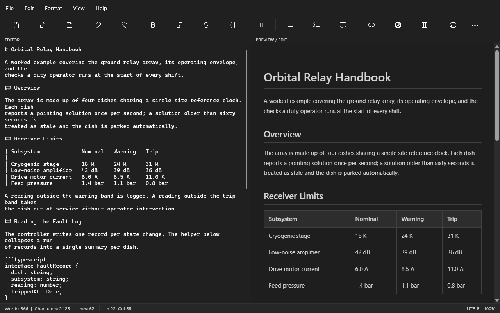
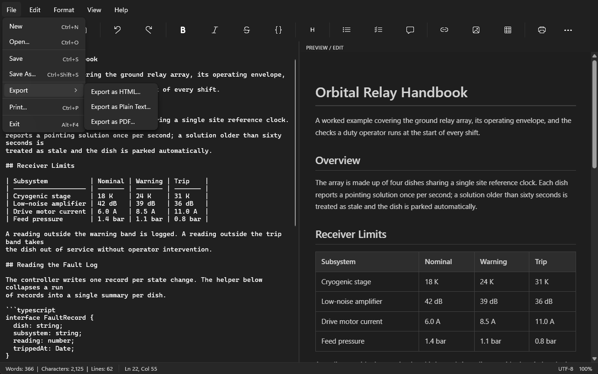

# MarkUp Markdown Editor

**Status:** released and actively developed · **Latest:** v1.7.0 · **Requires:** Windows 10 1809 (build 17763) or later

A modern, dark-mode Markdown editor and viewer for Windows, built with WinUI 3 and the Windows App SDK.

## Download

Grab the latest portable build from [Releases](https://github.com/JAD-Apps/MarkUp-Markdown-Editor/releases/latest) — unzip and run `MarkUp.exe`. Self-contained, so no .NET runtime is needed.

> Builds are currently unsigned; Windows SmartScreen will warn on first run.
> Choose **More info** → **Run anyway** if you trust the source.

## Features

- **WYSIWYG Preview Editor**: Edit directly in the rendered preview pane using the formatting toolbar and shortcuts — changes are automatically converted back to Markdown and synced to the source editor
- **Pane Parity**: Selections and the caret in the source editor are mirrored live in the preview (and back), and the two panes scroll together — synchronized scrolling can be toggled from the View menu
- **Rich-Text Paste**: Pasting from browsers, Word, or Outlook converts the clipboard HTML to clean Markdown
- **Clickable Links**: Ctrl+Click to follow links in the preview pane, with hover tooltips
- **Live Preview**: Split-pane editor with real-time rendered Markdown preview
- **Dark Mode**: Beautiful dark theme with Mica backdrop
- **Full Markdown Support**: Headings, bold, italic, strikethrough, code blocks, tables, task lists, blockquotes, images, links, and more
- **Formatting Toolbar**: Left-aligned quick-access toolbar buttons and keyboard shortcuts for all formatting operations
- **Find & Replace**: Built-in find and replace with case-sensitive matching, live match count, and wrap-around search in both directions

- **Print & Export**: Clean printing with document title header and page numbers — no about:blank in footers; print to PDF, export to HTML, and export to plain text with proper font colour management
- **Font Customization**: Configurable editor font family and size
- **Zoom Controls**: Zoom in/out — both panes scale together
- **View Modes**: Switch between split view, editor-only, and preview-only
- **Word Wrap Toggle**: Enable or disable word wrapping in the editor
- **Status Bar**: Live word count, character count, line count, cursor position, and zoom level
- **Persistent Settings**: Font, zoom, view mode, word wrap, synchronized scrolling, status-bar visibility, and window size are remembered between sessions
- **Unsaved-Changes Protection**: Closing the app, opening a file, or starting a new document prompts to save pending changes
- **File Associations**: Registered as a handler for `.md`, `.markdown`, `.mdown`, `.mkd` files
- **About Dialog**: Displays version, build date, runtime, architecture, and OS information
- **Markdown Quick Reference**: Built-in cheat sheet accessible from the Help menu
- **Keyboard Shortcuts**: Standard shortcuts for all common operations

## Keyboard Shortcuts

| Action | Shortcut |
|--------|----------|
| New | Ctrl+N |
| Open | Ctrl+O |
| Save | Ctrl+S |
| Save As | Ctrl+Shift+S |
| Print | Ctrl+P |
| Undo | Ctrl+Z |
| Redo | Ctrl+Y |
| Cut | Ctrl+X |
| Copy | Ctrl+C |
| Paste | Ctrl+V |
| Select All | Ctrl+A |
| Find & Replace | Ctrl+F or Ctrl+H |
| Bold | Ctrl+B |
| Italic | Ctrl+I |
| Inline Code | Ctrl+E |
| Insert Link | Ctrl+K |
| Follow Link | Ctrl+Click |
| Zoom In | Ctrl++ |
| Zoom Out | Ctrl+- |
| Reset Zoom | Ctrl+0 |

## License

MarkUp Markdown Editor is **source-available, not open source**, under the
[PolyForm Noncommercial License 1.0.0](LICENSE).

You may read, build and modify the source for any noncommercial purpose.
Commercial use — including redistribution, resale, or publishing to an
application store — is reserved to JAD Apps. For a commercial licence,
get in touch via [jadapps.app](https://jadapps.app).

© 2026 John Donnelly, trading as JAD Apps.
